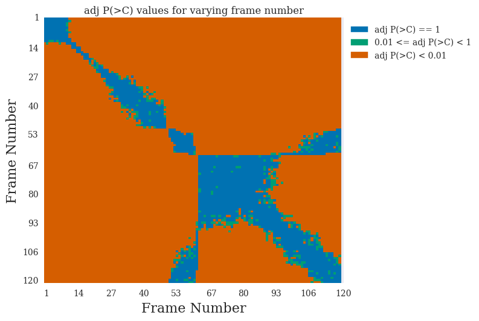

# CorMapAnalysis
Library to visualise the CorMap (Correlation Map) test results for SAXS data. If you use this library for your work, please cite [[1]](#references).

### Contents
- [Introduction](#introduction)
- [Installation](#installation)
- [Usage](#usage)
- [Known Issues](#known-issues)
- [References](#references)

### Introduction
The library provided in this repository provides methods to analyse and visualise results from the CorMap test [[2]](#references) which is performed by the [DATCMP](https://www.embl-hamburg.de/biosaxs/manuals/datcmp.html) program within the [ATSAS](https://www.embl-hamburg.de/biosaxs/software.html) software suite [[3]](#references). Mostly it allows users to assess the similarity of frames and hence has the potential to determine systematically which frames can be merged for SAXS data processing.

### Installation
Currently the only way to use this package is get the code from the [CorMapAnalysis.py file.](https://github.com/GarmanGroup/CorMapAnalysis/blob/master/CorMapAnalysis.py) If you use Github then you can clone the repository to obtain it by running
```
git clone https://github.com/GarmanGroup/CorMapAnalysis.git
```
in the command prompt/terminal. Otherwise you can just copy and paste the Python code into a new .py file.

### Usage
After [installing](#installation) the *CorMapAnalysis* module, the **ScatterAnalysis** class can be imported in the usual fashion. Below is a small script that shows how straightforward it is to create the ScatterAnalysis object and generate a heatmap from the data
```python
from CorMapAnalysis import ScatterAnalysis
scat_obj = ScatterAnalysis("path/to/mydata_00*")
scat_obj.plot_heatmap()
```
Which generates the following   
   

To get information on each method, use the inbuilt `help` method in Python. For example to get the documentation for the heatmap method type
```python
help(scat_obj.plot_heatmap)
```
All methods have been thoroughly documented using the [Numpy style docstring format](http://sphinxcontrib-napoleon.readthedocs.io/en/latest/example_numpy.html). For a tutorial that you can follow with sample data check out the [tutorial](https://github.com/GarmanGroup/CorMapAnalysis/tree/master/Tutorial).

### Known Issues
- The class may not read data that is subtracted with [DATOP](https://www.embl-hamburg.de/biosaxs/manuals/datop.html) (from the ATSAS suite) because the format doesn't read nicely with the Numpy `loadtxt` method. I need to write a custom parser so it will work.
- The `plot_scatter` method currently plots 2 figures and two x-axes which may not overlap well. I need to revert back to plotting a single x-axis.
- The pairwise CorMap plots should give values of either 1 (white) or -1 (black) but the colorbar gives a continuous output between 1 and -1 which is misleading. I need to sort this out so the colorbar only displays 1 or -1.

### References
[1] Brooks-Bartlett, J.C., Batters, R.A., Bury, C.S., Lowe, E.D., Ginn, H.M., Round, A. & Garman, E.F.    
Development of tools to automate quantitative analysis of radiation damage in SAXS experiments    
*J. Synchrotron Rad*. (2016). **23**   
[doi:10.1107/S1600577516015083](https://doi.org/10.1107/S1600577516015083). (***Not yet online***)

[2] Franke, Daniel, Cy M. Jeffries, and Dmitri I. Svergun.   
"Correlation Map, a goodness-of-fit test for one-dimensional X-ray scattering spectra"   
*Nature methods* (2015). **12.5**, 419-422   
[doi:10.1038/nmeth.3358](https://doi.org/10.1038/nmeth.3358)

[3] Petoukhov, M.V., Franke, D., Shkumatov, A.V., Tria, G., Kikhney, A.G., Gajda, M., Gorba, C., Mertens, H.D.T., Konarev, P.V. and Svergun, D.I. (2012)   
"New developments in the ATSAS program package for small-angle scattering data analysis"   
*J. Appl. Cryst.* **45**, 342-350
[doi:10.1107/S0021889812007662](https://doi.org/10.1107/S0021889812007662)
