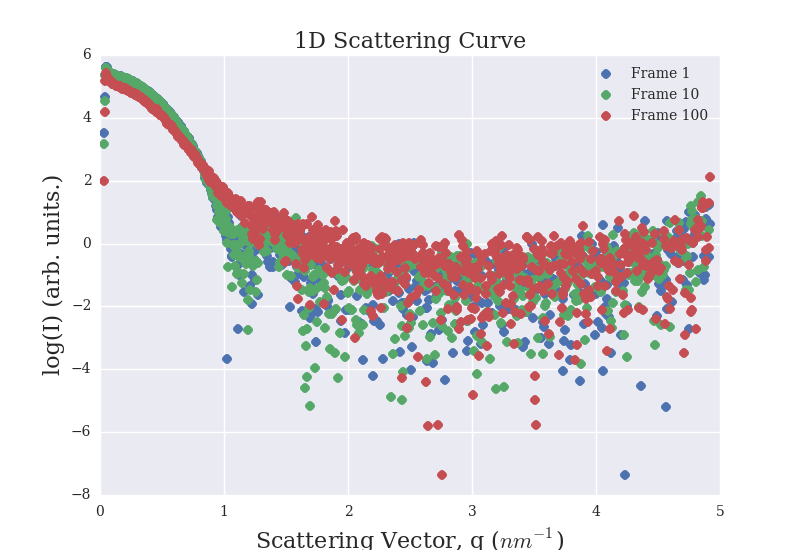
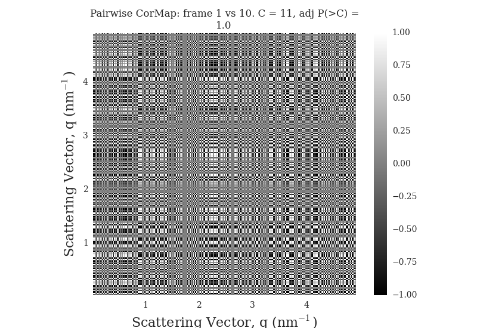
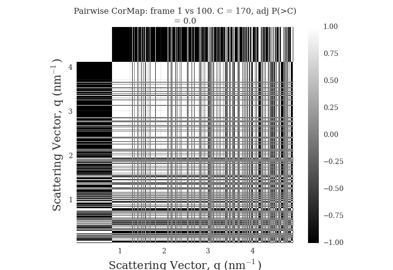
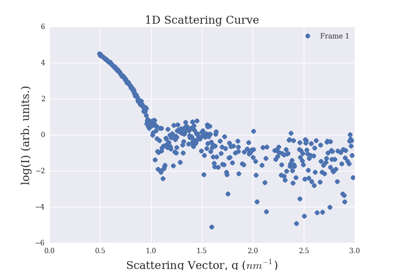

# CorMapAnalysis Tutorial

If you haven't already then you need to clone the repository to get all of the data. The instructions for this can be seen in the [*installation*](https://github.com/GarmanGroup/CorMapAnalysis#installation) section on the main page.   

We can import the ScatterAnalysis class and create an instance of the class from the 1D SAXS curves that are stored in the [data](https://github.com/GarmanGroup/CorMapAnalysis/tree/master/Tutorial/data) directory by entering
```python
>>> from CorMapAnalysis import ScatterAnalysis
>>> scat_obj = ScatterAnalysis.from_1d_curves("path/to/mydata_00*")
```
You can use the example data that is provided in the repository which is contained in the `Tutorial/data/` directory.   

The new object now offers several methods that can be used to analysis the CorMap test results. Each method has been thoroughly documented using the [Numpy style docstring format](http://sphinxcontrib-napoleon.readthedocs.io/en/latest/example_numpy.html) so we can generate documentation for any method we like. For example let's generate the documentation for the `find_diff_frames` method by typing
```python
>>> help(scat_obj.find_diff_frames)
```
This yields the following documentation:
```
Help on method find_diff_frames in module CorMapAnalysis:

find_diff_frames(self, frame=1, P_threshold=0.01, P_type='adjP') method of CorMapAnalysis.ScatterAnalysis instance
    List all statistically dissimilar frames.

    This method finds all statistically dissimilar frames to any given
    frame using the CorMap test as outlined in Daniel Franke, Cy M Jeffries
    & Dmitri I Svergun (2015). The user can set the significance threshold
    as well as whether to use the Bonferroni corrected P values or not.
    (we recommend that you should use the Bonferroni corrected P values).

    Parameters
    ----------
    frame : int, optional (default=1)
        The frame that every other frame in the dataset is compared with.
        If not specified then all frames are compared to the first frame.
    P_threshold : float, optional (default=0.01)
        The significance threshold of the test. If it's not given then the
        default value is 1%.
    P_type : str, optional (default="adjP")
        String denoting whether to use the Bonferroni corrected P value
        (input string="adjP") or the ordinary P value (input string="P").
        Default is to use the Bonferroni corrected P value.

    Returns
    -------
    List
        A list of integers corresponding to all of the dissimilar frames

    Examples
    --------
    Find all frames that are dissimilar to frame 10

    >>>  diff_frames = scat_obj.find_diff_frames(frame=10)
```
Here we can see that this is a method that list all frames that are statistically different to some chosen frame.

We can also list frames that are statistically similar to a given frame. To find frames that are statistically similar to frame 1, we can type:
```python
>>> scat_obj.similar_frames(frame=1)
[1, 2, 3, 4, 5, 6, 7, 8, 9, 10, 11]
```

Not only can we return lists of similar frames but we can also plot the scattering curves. Let's plot frames 1, 10 and 100 on the same graph.
```python
>>> scat_obj.plot_1d_intensity([1, 10, 100])
```
This gives the following graph   
   
If we don't want to display the plot (or indeed any plots) then we can save it. To save this plot to the current working directory we can type.
```python
>>> scat_obj.plot_1d_intensity([1, 10, 100], display=False, save=True, filename="intensity_curve.png")
```
We can see from the above figure (and from the `similar_frames` method) that frames 1 and 10 (blue and green curves) overlap. However frame 100 (red curve) is dissimilar.
We can check the pairwise correlation map (as described in the [original CorMap paper](https://doi.org/10.1038/nmeth.3358)) comparing frames 1 vs 10 and frames 1 vs 100 by running the following commands respectively:
```python
>>> scat_obj.plot_pwcormap(1, 10)
>>> scat_obj.plot_pwcormap(1, 100)
```
giving
   
and   
.

Notice that the comparison between frames 1 and 10 looks like a randomised lattice, whereas the correlation map between frames 1 and 100 looks less random as there are larger patches of black and white, especially the large white patch in the top left corner.

### Cropping regions of the 1D curve
Some regions of the curves can be quite noisy and so we may not want to include them in the analysis. We can crop these regions by calling the constructor as follows
```python
>>>  scat_obj = ScatterAnalysis.from_1d_curves("path/to/mydata_00*", first=99, smax=3.0)
```
This example creates a ScatterAnalysis object where we've crop
the first 99 frames and use data up to a scattering angle of 3 nm^{-1}.   

We can see the cropped intensity curve in the first frame by entering
```python
scat_obj.plot_1d_intensity(1)
```

